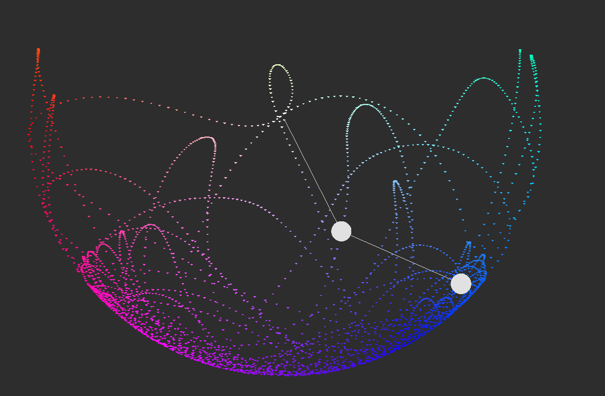

# Double Pendulum Simulation

## Table of Contents
* [General](#general)
* [Features](#features)
* [Screenshots](#screenshots)
* [Setup](#setup)
* [Usage](#usage)
* [Project Status](#project-status)
* [Acknowledgements](#acknowledgements)
* [TODOs](#todos)

## General
Simulates the chaotic motion of a double pendulum in C++ using SFML, a third party OpenGL wrapper. This project is an introduction to SFML for me, hence its size and capabilities.

## Features
- Pause and resume simulation

## Screenshots

## Setup
### Requirements 
- C++20
- SFML

## Usage
Press SPACE to pause / resume simulation.

## Project Status
Almost finished.

## Acknowledgements
- Check out SFML: https://www.sfml-dev.org/
- SFML repo: https://github.com/SFML/SFML

## TODOs
- Drag masses around with the mouse
